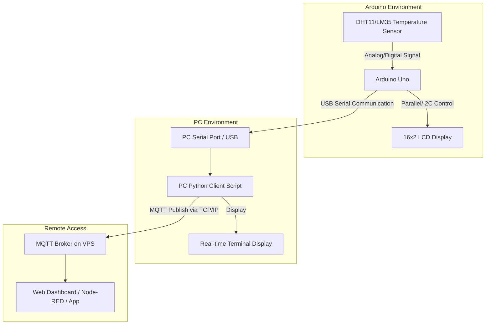

# System Architecture Diagram

## Communication Protocols Used

As requested by the exam requirements:

1. **Serial Communication between Arduino and PC**: 
   - Protocol: UART over USB
   - Port: e.g., `COM3` (Windows) or `/dev/ttyACM0` (Linux)
   - Baud Rate: 9600 bps

2. **MQTT Topic used for publishing**:
   - Protocol: MQTT (TCP/IP Port 1883)
   - Topic Name: `student/sensor/temperature` (Configurable in `pc_client.py`)
